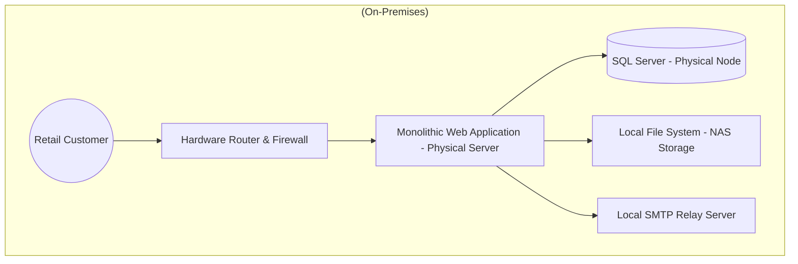

# Cloud Migration & Adoption: Retail Solution Case Study

## 📋 Table of Contents
* [1. Objective](#1-objective)
* [2. Section 1: On-Premises Solution Design](#2-section-1-on-premises-solution-design)
* [3. Section 2: Migration Strategies](#3-section-2-migration-strategies)
* [4. Section 3: Comparative Study of Cloud Providers](#4-section-3-comparative-study-of-cloud-providers)
* [5. Conclusion](#5-conclusion)

---

## 1. Objective
This project evaluates the migration of an existing mid-sized retail firm off-premises on an old infrastructure to a new cloud infrastructure. It is aimed at comparing models of IaaS, PaaS, and SaaS and choosing the most effective path of migration of different business elements.

---

## 2. Section 1: On-Premises Solution Design

### Current Architecture Overview
The retail company has **monolithic architecture**. All services are hosted on the company's data center



* **Web Application:** A single-tier monolithic app hosted on physical Windows servers
* **Backend Database:** SQL Server running on a dedicated physical machine
* **File Storage:** Local Network Attached Storage (NAS) for product images and documents
* **Networking:** Managed routers and hardware-based firewalls
* **Email Services:** An on-premises SMTP server used for sending customer order confirmations

### Component Identification for Migration
| Component | Current State | Target Cloud Model |
| :--- | :--- | :--- |
| Web Application | Physical Server | **PaaS** (Managed Hosting) |
| SQL Database | Physical SQL Server | **PaaS** (Managed Database) |
| File Storage | Local NAS | **IaaS/PaaS** (Cloud Object Storage) |
| Networking | Physical Hardware | **Cloud-Native** (Virtual Private Cloud) |
| Email Services | Local SMTP | **SaaS** (Managed Email API) |

---

## 3. Section 2: Migration Strategies

We recommend a **Hybrid Migration Approach** to ensure business continuity while reducing operational overhead.


```mermaid

graph LR
    subgraph "Legacy (On-Prem)"
    A[Web App]
    B[SQL DB]
    C[File Store]
    D[Email]
    end

    subgraph "Cloud Target (Azure/AWS/GCP)"
    A1[Web App Service - PaaS]
    B1[Managed SQL - PaaS]
    C1[Object Storage - PaaS]
    D1[Cloud Email - SaaS]
    end

    A -- "Refactor" --> A1
    B -- "Replatform" --> B1
    C -- "Rehost" --> C1
    D -- "Replace" --> D1
 ```
    
### Proposed Strategy for Each Component

1.  **Web Application → PaaS (Refactoring)**
    * *Decision:* Move to a managed service like Azure App Service/ AWS Elastic Beanstalk
    * *Reasoning:* Removes the need to manage the OS or hardware. Allows for **Auto-scaling** for high-traffic 
2.  **Database → PaaS (Replatforming)**
    * *Decision:* managed instance (e.g., Amazon RDS)
    * *Reasoning:* Automates backups, patching high availability without changing the database engine
3.  **File Storage → PaaS (Replatforming)**
    * *Decision:*  Cloud Object Storage (e.g., AWS S3)
    * *Reasoning:* Offer 99% durability and makes images easily accessible  
4.  **Networking → Cloud-Native Networking**
    * *Decision:* Re-architect using Virtual Private Clouds (VPC), Subnets, and Security Groups
    * *Reasoning:* Replaces physical firewalls with software-defined security that is easier to update
5.  **Email Service → SaaS (Replacing)**
    * *Decision:* Replace the local SMTP server with a SaaS provider
    * *Reasoning:* Eliminates the difficulty of maintaining email server 

---

## 4. Section 3: Comparative Study of Cloud Providers

| Service Category | AWS Offering | Azure Offering | GCP Offering |
| :--- | :--- | :--- | :--- |
| **IaaS (Compute)** | EC2 Instances | Virtual Machines | Compute Engine |
| **PaaS (Web App)** | Elastic Beanstalk | App Service | App Engine |
| **PaaS (SQL DB)** | Amazon RDS | Azure SQL | Cloud SQL |
| **PaaS (Storage)** | Amazon S3 | Azure Blob Storage | Cloud Storage |
| **SaaS (Email)** | Amazon SES | Microsoft 365 | Google Workspace |

---

## 5. Conclusion
Moving from an on-premises retail environment to the cloud provides the company with **elasticity** and **cost-efficiency**

